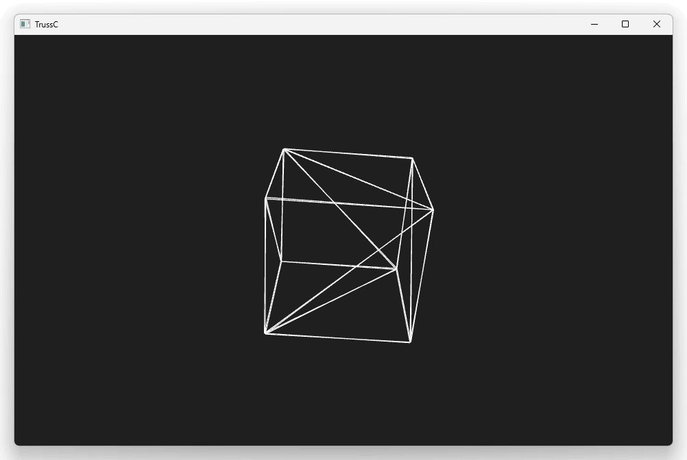
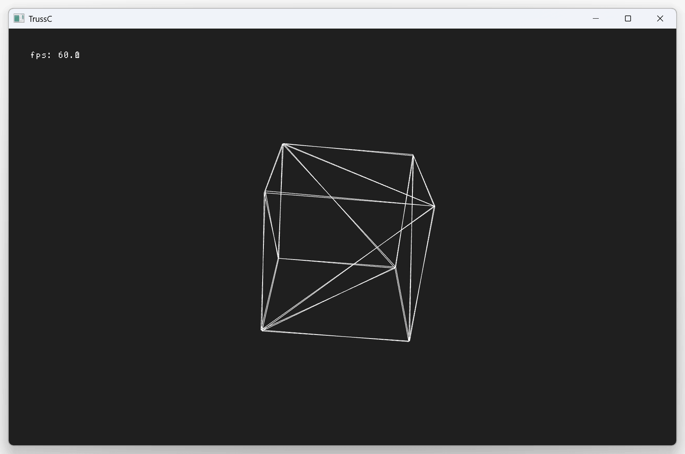
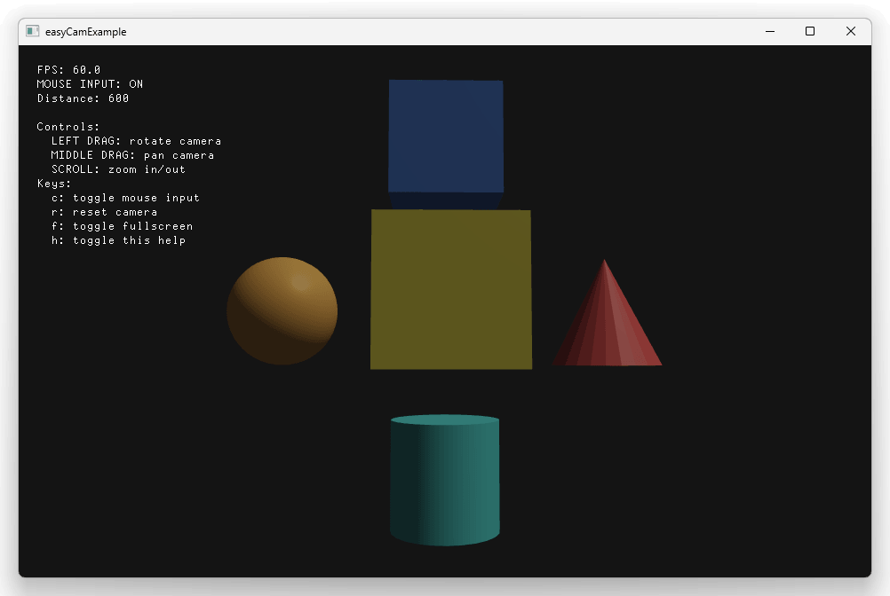
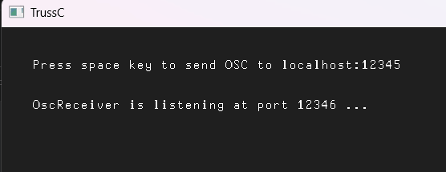
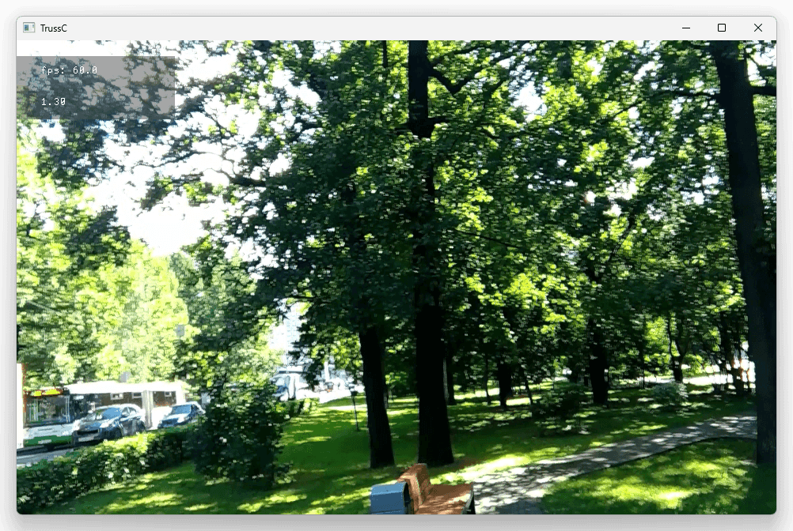

# TrussCExample.jl

[TrussC](https://trussc.org/) Julia example, using [TrussC.jl](https://github.com/funatsufumiya/TrussC.jl)

## Sample code



```julia
module TrussCExample

using TrussC

# tc = TrussC

function setup()
  setFps(60.0f0)
end

function draw()
  clear(0.12f0, 1.0f0)

  # Rotating box
  pushMatrix();
  noFill();
  translate(getWindowWidth() / 2.0f0, getWindowHeight() / 2.0f0);
  rotate(Float32(getElapsedTimef() * 0.1f0), Float32(getElapsedTimef() * 0.15f0), 0.0f0);
  drawBox(200.0f0);
  popMatrix();
end

function keyPressed(key::Cint)
  c = Char(key)
  println("key: ", c, " (", key ,")")
end

function main()
  @setup(setup)
  @draw(draw)
  @keyPressed(keyPressed)

  runTrusscApp()
end

end # module TrussCExample

```

## Usage

### Basic Example

[src/BasicExample.jl](src/BasicExample.jl)

```bash
$ julia --project=@. -e 'using Pkg; Pkg.instantiate()'
$ julia --project=@. -e 'using TrussCExample; TrussCExample.main();'
```



### EasyCam example

[src/EasyCamExample.jl](src/EasyCamExample.jl)

```bash
$ julia --project=@. -e 'using Pkg; Pkg.instantiate()'
$ julia --project=@. -e 'using TrussCExample; EasyCamExample.main();'
```



### OSC example

[src/OscExample.jl](src/OscExample.jl)

```bash
$ git checkout osc
$ julia --project=@. -e 'using Pkg; Pkg.instantiate()'
$ julia --project=@. -e 'using TrussCExample; OscExample.main();'

# ---

$ git checkout main # NOTE: when ended
```



### Hap example

[src/HapExample.jl](src/HapExample.jl)

```bash
$ git checkout hap
$ julia --project=@. -e 'using Pkg; Pkg.instantiate()'
$ julia --project=@. -e 'using TrussCExample; HapExample.main();'

# ---

$ git checkout main # NOTE: when ended
```



## Known Issues

> [!Warning]
> ***Windows CxxWrap.jl issue***<br><br>
> If not working CxxWrap.jl on Windows, you need to try [Building libcxxwrap-julia](https://github.com/JuliaInterop/libcxxwrap-julia#building-libcxxwrap-julia) (Because prebuilt packaged dll for CxxWrap.jl is not compatible with MSVC).<br>
> Please see [Windows libcxxwrap_julia_jll build](https://github.com/funatsufumiya/CxxWrapTest.jl#windows-libcxxwrap_julia_jll-build) of https://github.com/funatsufumiya/CxxWrapTest.jl or https://github.com/JuliaInterop/libcxxwrap-julia in detail.<br>
>
> If it's too hard for you to manually build `libcxxwrap_julia_jll/override`, You can use [my prebuilt override.zip](https://github.com/funatsufumiya/TrussC.jl/releases/tag/libcxxwrap_julia_jll_override) (built for libcxxwrap_julia_jll 0.14.9+0, version at 2026/05/15.)<br>
>
> (or, just use WSL. It's much easier.)